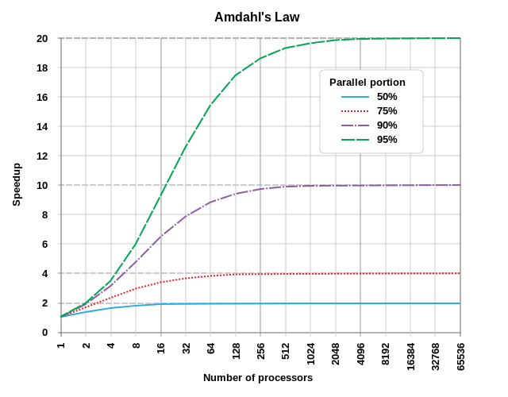

## 암달의 법칙

> 암달의 법칙은 시스템에 리소스를 추가함으로써 얻을 수 있는 컴퓨터 작업 성능 향상의 최대 폭을 나타내주는 공식이다. 일반적으로 병렬 컴퓨팅에서 이를 이용하여, 프로세서 개수의 증가가 프로그램 자체의 구조적 병렬화 제한을 맞서 실제적으로 가져다주는 이득을 예측할 수 있다.

예시를 살표보자. 어떠한 프로그램이 단일 프로세서로 구동되어야 하는 부분 A와 병렬화될 수 있는 부분 B로 이루어져있다고 할 때, 우리는 프로세서의 추가적인 투입이 제한된 이득만을 가져다줌을 알 수 있다. B 부분의 성능을 크게 향상시킬 수 있지만, A 부분의 속도는 그대로 남을 것이기 때문이다.

아래의 그래프는 성능 향상 가능성의 예시를 보여준다.

이미지에서 보다시피 50%나 병렬화 가능한 프로그램임에도 10개의 프로세서 이후에는 거의 이득이 없는 반면, 95% 병렬화 가능한 프로그램은 수천 개가 추가될 때까지도 유의미한 성능 향상을 보여주고 있다.

[**무어의 법칙**](https://ko.wikipedia.org/wiki/%EB%AC%B4%EC%96%B4%EC%9D%98_%EB%B2%95%EC%B9%99)과 개별 프로세서의 성능 증가 속도가 완화되면서, 병렬화는 최적화의 핵심이 되었다. 그래픽스 프로그래밍이 이에 대한 가장 알맞는 예시이다. 셰이더 기반의 최신 컴퓨팅에서는 개별 픽셀 혹은 프래그먼트를 병렬로 렌더링할 수 있는데, 이것이 최신 그래픽 카드들이 대개 수천 개의 코어(GPU 또는 셰이더 유닛)로 구성된 이유이다.
