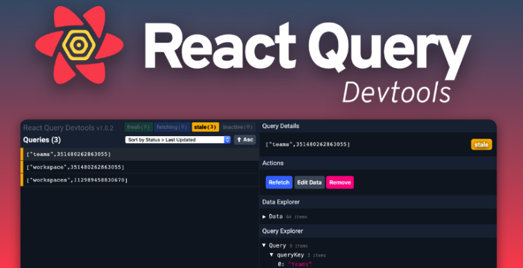

## 리액트 쿼리란?

- react-query는 리액트 애플리케이션에서 서버 상태 가져오기, 캐싱, 동기화 및 업데이트를 보다 쉽게 다룰 수 있도록 도와주는 라이브러리다. 클라이언트 상태와 서버 상태를 명확하게 구분하기 위해 만들어 졌다.
- react-query에서는 기존 상태관리 라이브러리인 redux, mobX가 클라이언트 상태 작업에 적합하지만, 비동기 또는 서버 상태 작업에는 그다시 좋지 안핟고 언급한다.
- 클라이언트 상태와 서버 상태는 완전히 다른 개념이며, 클라이언트 상태는 각각의 input 값으로 예를 들 수 있고, 서버 상태는 데이터 베이스에 저장되어 있는 데이터로 예를 들 수 있다.

## 리액트 쿼리의 기능

- 캐싱
- 동일한 데이터에 대한 중복 요청을 단일 요청으로 통합
- 백그라운드에서 오래된 데이터 업데이트
- 데이터가 얼마나 오래되었는지 알 수 있다.
- 데이터 업데이트를 가능한 빠르게 반영
- 페이지네이션 및 데이터 지연 로드와 같은 성능 최적화
- 서버 상태의 메모리 및 가비지 수집 관리
- 구조 공유를 사용하여 쿼리 결과를 메모화

## 리액트 쿼리 기본 설정

```javascript
import { QueryClient } from "@tanstack/react-query";

const queryClient = new QueryClient({
  defaultOptions: {
    queries: {
      staleTime: Infinity,
      // ...
    },
  },
});
```

- QueryClient를 사용하여 캐시와 상호 작용할 수 있다.
- QueryClient에서 모든 query 또는 mutation에 기본 옵션을 추가할 수 있으며, 종류가 상당하기 때문에 공식 문서를 참고해보자.

```javascript
import { QueryClient, QueryClientProvider } from '@tanstack/react-query';

const queryClient = new QueryClient({ /* options */});

function App() {
  return (
   <QueryClientProvider client={queryClient}>
      <div>블라블라</div>
   </QueryClientProvider>;
  );
}
```

- react-query를 사용하기 위해서는 QueryClientProvider를 최상단에 감싸주고 QueryClient 인스턴스를 client props로 넣어 애플리케이션에 연결시켜야 한다.
- 위 예시에서 App.js에 QueryClientProvider로 컴포넌트를 감싸고, client props에다 queryClient를 연결함으로써, 이 context는 앱에서 비동기 요청을 알아서 처리하는 background 계층이 된다.

## Devtools



- react-query는 전용 devtools를 제공한다.
- devtools를 사용하면 React Query의 모든 내부 동작을 시각화하는 데 도움이 되며 문제가 발생하면 디버깅 시간을 절약할 수 있도록 도와준다.
- devtools는 기본값으로 process.env.NODE_ENV === 'development'인 경우에만 실행된다. 즉, 일반적으로 개발 환경에서만 작동하도록 설정되어 있으므로, 프로젝트 배포 시에 Devtools 삽입 코드를 제거해 줄 필요가 없다.
- **devtools를 사용하기 위해서는 별도의 패키지 설치가 필요하다.**

```javascript
$ npm i @tanstack/react-query-devtools
# or
$ pnpm add @tanstack/react-query-devtools
# or
$ yarn add @tanstack/react-query-devtools
```

```javascript
import { ReactQueryDevtools } from "@tanstack/react-query-devtools";

function App() {
  return (
    <QueryClientProvider client={queryClient}>
      {/* The rest of your application */}
      <ReactQueryDevtools initialIsOpen={false} />
    </QueryClientProvider>
  );
}
```

## Devtools Options

- initialIsOpen (Boolean)
  : true면 개발 도구가 기본적으로 열려 있도록 설정할 수 있다.
- position? <br/>
  : "top-left" | "top-right" | "bottom-left" | "bottom-right" <br/>
  - 기본값: "bottom-left"
  - devtools 패널을 열고 닫기 위한 로고 위치
- 일반적으로 initialIsOpen, position을 자주 사용하지만, panelProps, closeButtonProps, toggleButtonProps와 같은 옵션도 존재한다.

## 캐싱 라이프 사이클

- [React Query 캐시 라이프 사이클 공식 문서](https://tanstack.com/query/v5/docs/framework/react/guides/caching)

> - 캐시 데이터가 있거나 없는 쿼리 인스턴스
> - 백그라운드 리패칭
> - 비활성 쿼리
> - 가비지 컬렉션

- gcTime 의 기본값 5분, staleTime 기본값 0초를 가정

1. **A**라는 queryKey를 가진 A 쿼리 인스턴스가 **mount**됨
2. 네트워크에서 데이터 fetch하고, 불러온 데이터는 A라는 queryKey로 캐싱함
3. 이 데이터는 **fresh** 상태에서 **staleTime(기본값 0)** 이후 **stale** 상태로 변경됨
4. A 쿼리 인스턴스가 **unmount**됨
5. 캐시는 **gcTime(기본값 5min)** 만큼 유지되다가 **가비지 콜렉터**로 수집됨
6. 만일, gcTime 지나기 전이고, A 쿼리 인스턴스 fresh한 상태라면 새롭게 mount되면 캐시 데이터를 보여준다.
